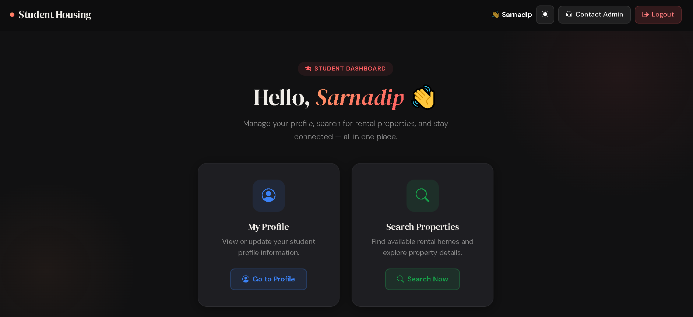
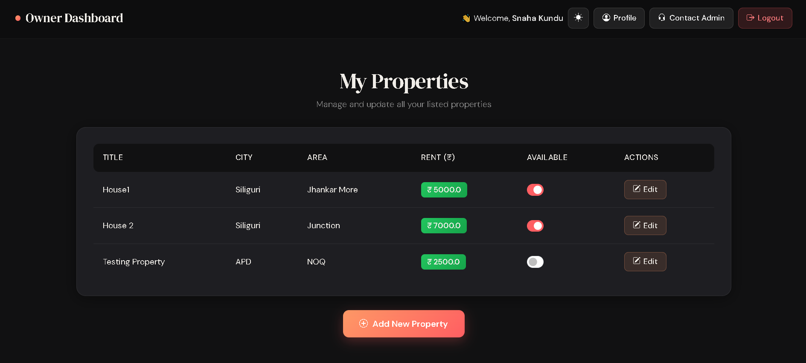
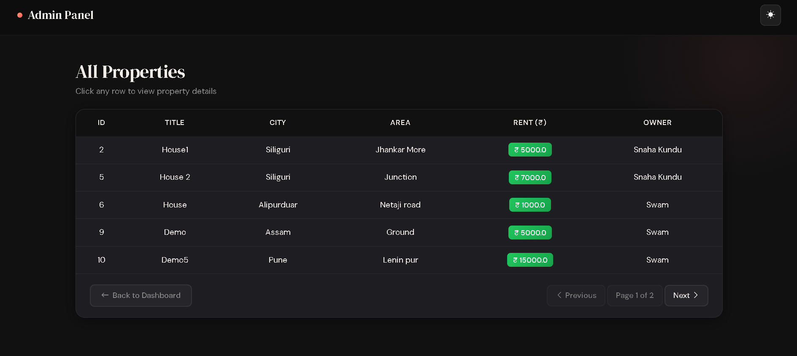
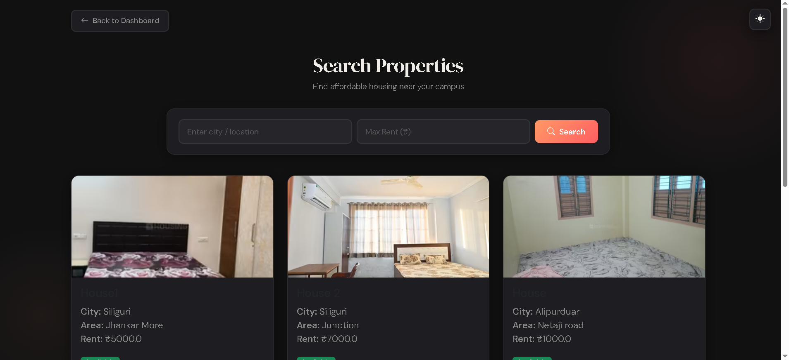
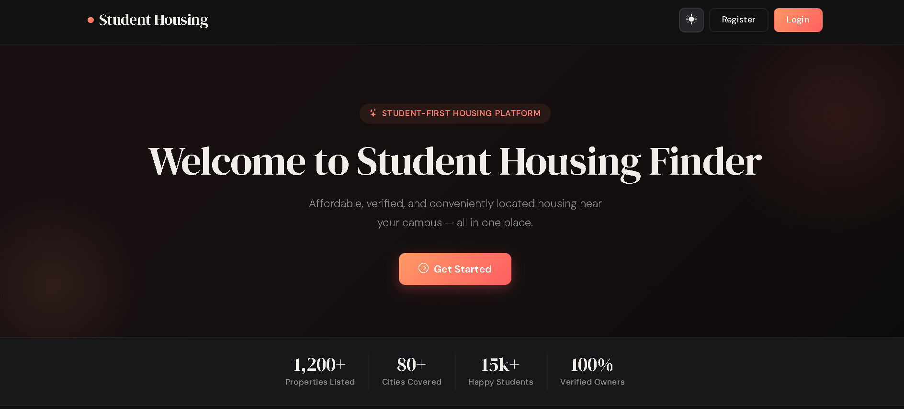

# 🏠 Student Housing Management System

## 📌 Overview
The **Student Housing Management System** is a web-based platform built using **Java Spring Boot, Spring Security, Thymeleaf, and MySQL**.  
It enables **students** to search and book rental properties, while **owners** can list and manage their properties.  
The system also includes **admin features** for managing users and maintaining platform integrity.

---

## 🚀 Features

### 👨‍🎓 Student Features
- Secure login & registration
- Manage personal profile
- Search for rental properties
- View property details
- User-friendly dashboard

### 🏠 Owner Features
- Register & manage rental properties
- Upload property images (Cloudinary integration)
- Update or delete listed properties
- Dashboard for property management

### 🔑 Admin Features
- Manage students & owners
- Update or delete any user
- Access to all properties
- Ensure platform compliance

---

## 🛠️ Tech Stack
- **Backend**: Java 17, Spring Boot
- **Frontend**: Thymeleaf, Bootstrap 5, Animate.css
- **Database**: MySQL
- **Security**: Spring Security with role-based authentication (Student, Owner, Admin)
- **Cloud Storage**: Cloudinary (for property image storage)

---

## ⚙️ Implementation Details

### 1️⃣ Authentication & Authorization
- Spring Security used for **login, logout, and role-based access control**.
- Roles: `ROLE_STUDENT`, `ROLE_OWNER`, `ROLE_ADMIN`.

### 2️⃣ File Storage
- Images uploaded to **Cloudinary**.
- When properties are deleted, images are also removed from Cloudinary.

### 3️⃣ Error Handling
- Custom error page implemented for exceptions (e.g., user not found).

### 4️⃣ Responsive UI
- Bootstrap 5 used for responsiveness.
- **Navbar buttons** collapse into a **three-dots (⋮) dropdown menu** on smaller screens.

## 📂 Project Structure
```
src/main/java/com/studenthousing
│── controller/     # Controllers for Student, Owner, Admin
│── model/          # Entity classes (User, Property, Role)
│── repository/     # JPA Repositories
│── service/        # Business logic & Cloudinary integration
│── config/         # Spring Security configuration
│
src/main/resources/templates
│── student/        # Student dashboard & profile pages
│── owner/          # Owner property management pages
│── admin/          # Admin management pages
│── error.html      # Custom error page
```

---

## 🖼️ Screenshots

### Student Dashboard


### Owner Dashboard


### Admin User Management


### Property Details


### Search Properties


### Home / Index Page


---

## ▶️ Running the Project

### 1️⃣ Clone Repository
```bash
git clone https://github.com/yourusername/student-housing-system.git
cd student-housing-system
```

### 2️⃣ Configure MySQL
Update `application.properties`:
```properties
spring.datasource.url=jdbc:mysql://localhost:3306/housing_db
spring.datasource.username=root
spring.datasource.password=yourpassword
```

### 3️⃣ Configure Cloudinary
Add in `application.properties`:
```properties
cloudinary.cloud_name=your_cloud_name
cloudinary.api_key=your_api_key
cloudinary.api_secret=your_api_secret
```

### 4️⃣ Run the Application
```bash
mvn spring-boot:run
```

Then open [http://localhost:8080](http://localhost:8080).

---

## 👥 Roles & Access
- **Student** → Search properties, view profile
- **Owner** → Add/manage properties
- **Admin** → Manage users & properties

---

## 📌 Future Enhancements
- Booking system for students
- Payment gateway integration
- Notification system for owners/students
- Advanced analytics for admins

---

## 🏆 Conclusion
The **Student Housing Management System** provides a **centralized platform** for students, owners, and admins.  
It is secure, scalable, and extendable for future needs.\
Helps students