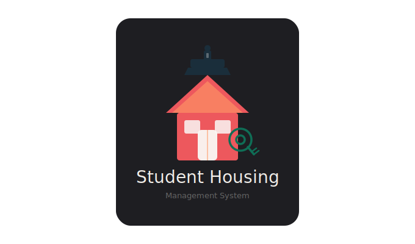

<div align="center">



<h1>Student Housing Management System</h1>
<h3>A web-based platform for students, owners, and administrators</h3>

[](https://www.java.com)
[](https://spring.io/projects/spring-boot)
[](https://neon.tech)
[](https://www.thymeleaf.org)
[](https://cloudinary.com)
[](LICENSE)

*A centralized, secure, and scalable platform for students, property owners, and administrators*

[Features](#-features) · [Tech Stack](#️-tech-stack) · [Screenshots](#️-screenshots) · [Setup](#️-running-the-project) · [API Docs](#-pages--routes) · [Author](#-conclusion)

</div>

---

## 📌 Overview

**Student Housing Management System** is a web-based platform built using **Java Spring Boot, Spring Security, Thymeleaf, and PostgreSQL (Neon)**. It enables **students** to search for rental properties, **owners** to list and manage their properties, and **admins** to manage users and maintain platform integrity.

> No extra app install needed. Works in any browser. Designed for students and property owners alike. Data is stored in the cloud via Neon PostgreSQL — accessible from any machine.

---

## 🚀 Features

<table>
<tr>
<td width="50%">

### 👨‍🎓 Student Features
- 🔐 Secure login & registration
- 👤 Personal profile (ID, email, phone)
- 🔍 Search properties by city, area, and max rent
- 📍 **Location-based search** — find properties near you using GPS
- 🗺️ Adjustable search radius (2 / 5 / 10 / 20 km)
- 🖼️ View full property details with image carousel
- 📞 Owner contact info on property page
- 🏠 User-friendly dashboard

</td>
<td width="50%">

### 🏠 Owner Features
- 📝 Register & manage rental properties
- ☁️ Upload multiple images (Cloudinary)
- ✏️ Edit title, city, area, rent, description
- 🗑️ Delete individual images from listings
- 🔄 Toggle property availability from dashboard
- 📊 Dashboard with full properties table
- 🌐 **Auto-geocoding** — GPS coordinates saved automatically from city + area on property save

</td>
</tr>
<tr>
<td width="50%">

### 🔑 Admin Features
- 📊 Dashboard cards for Users, Properties, Register User
- 👥 View all registered users (paginated table)
- ✏️ Edit or delete any user
- 🚫 Admins cannot be deleted
- 🏘️ View all properties (paginated table)
- 🚷 Access denied page for unauthorized routes

</td>
<td width="50%">

### ⚙️ System Highlights
- 🔐 Role-based access (STUDENT, OWNER, ADMIN)
- 🔄 Custom login redirect per role
- ☁️ Cloudinary auto-delete on property removal
- 🌙 Light / dark mode with `localStorage` persistence
- 📱 Bootstrap 5 responsive layout
- 🚫 Custom 403 & error pages
- 🌐 Cloud-hosted database (Neon PostgreSQL)
- 📍 **Smart location search** with GPS + text fallback

</td>
</tr>
</table>

---

## 🛠️ Tech Stack

### Backend

| Technology | Version | Purpose |
|---|---|---|
| Java | 17 | Core language |
| Spring Boot + MVC | 3.x | REST API & MVC framework |
| Spring Security | 6.x | Role-based access control |
| Spring Data JPA | — | ORM & repository layer |
| PostgreSQL (Neon) | — | Cloud-hosted persistent data storage |
| Cloudinary | — | Image upload & auto-delete |
| OpenStreetMap Nominatim | — | Free geocoding & reverse geocoding (no API key needed) |

### Frontend

| Technology | Purpose |
|---|---|
| Thymeleaf | Server-side templating |
| Bootstrap 5 | Responsive layout & components |
| Animate.css | Entry animations |
| DM Serif Display + DM Sans | Typography (Google Fonts) |
| Browser Geolocation API | Student location detection |

---

## 🎨 UI Design System

All pages share a consistent design system using CSS variables, supporting seamless light/dark theme switching. Theme preference is saved in `localStorage` under the key `sh-theme`.

### Color Palette

| Variable | Light Mode | Dark Mode |
|---|---|---|
| `--accent` | `#FF5E62` | `#FF5E62` |
| `--accent-2` | `#FF9966` | `#FF9966` |
| `--bg` | `#FAF7F4` | `#111112` |
| `--card-bg` | `#FFFFFF` | `#1E1E22` |
| `--text` | `#1A1A1A` | `#F0EDE8` |
| `--text-muted` | `#777777` | `#888888` |
| `--input-bg` | `#F5F2EF` | `#26252A` |

---

## ⚙️ Implementation Details

### 1️⃣ Authentication & Authorization

- Spring Security used for **login, logout, and role-based access control**
- Roles: `ROLE_STUDENT`, `ROLE_OWNER`, `ROLE_ADMIN`
- Custom `LoginSuccessHandler` redirects each role to their respective dashboard on login
- Unauthorized access to protected routes redirects to `/access-denied` instead of the default Whitelabel 403 error

### 2️⃣ File Storage

- Images uploaded to **Cloudinary**
- When properties are deleted, images are also automatically removed from Cloudinary

### 3️⃣ Database — Neon PostgreSQL (Cloud)

- Database is hosted on **Neon** (free tier) — a serverless PostgreSQL platform
- Data is accessible from **any machine** without local setup
- Hibernate auto-creates and manages tables via `ddl-auto=update`

### 4️⃣ Location-Based Property Search

The platform features a **smart two-mode search system**:

**Mode 1 — Manual Search**

- Student enters city/area name and optional max rent
- Searches both `city` and `area` fields (case-insensitive, partial match)
- e.g. searching "Salbari" matches a property with `area="Salbari"` even if `city="Sukna"`

**Mode 2 — Find Near Me (GPS)**

- Student clicks "Find Near Me" — browser requests location permission
- Student can choose search radius: 2 / 5 / 10 / 20 km
- **Step 1 (GPS):** Haversine formula query finds properties with stored coordinates within the chosen radius, sorted by distance
- **Step 2 (Fallback):** If no GPS results, reverse geocoding via Nominatim converts the student's coordinates to a city/area name, then falls back to text-based matching
- This ensures results are always returned even when properties don't have GPS coordinates yet

**Auto-Geocoding on Property Save**

- When an owner saves a property, `GeoCodingService` automatically calls the Nominatim API to convert `city + area` into `latitude` + `longitude`
- Coordinates are stored silently — owners never need to enter GPS data manually
- As more properties are saved, GPS-based search coverage improves automatically

### 5️⃣ Error Handling

- Custom `/access-denied` page for 403 Forbidden errors
- Custom `error.html` for general exceptions (e.g., user not found)

### 6️⃣ Responsive UI

- Bootstrap 5 used for responsiveness
- Navbar buttons collapse into a dropdown on smaller screens
- Dark/light theme toggle on every page, synced via `localStorage`

---

## 📄 Pages & Routes

| Page | Template | Route | Access |
|---|---|---|---|
| Home | `index.html` | `/` | 🌐 Everyone |
| Login | `login.html` | `/login` | 🌐 Everyone |
| Register | `register-only-user.html` | `/register-user` | 🌐 Everyone |
| Access Denied | `access-denied.html` | `/access-denied` | 🌐 Everyone |
| Student Dashboard | `student-dashboard.html` | `/student/dashboard` | 🎓 STUDENT |
| Search Properties | `search-properties.html` | `/student-search` | 🎓 STUDENT |
| Search — Manual | `fragments/property-list` | `/search?city=&rent=` | 🎓 STUDENT |
| Search — Near Me | `fragments/property-list` | `/properties/nearby?lat=&lng=&radius=` | 🎓 STUDENT |
| Owner Dashboard | `owner-properties.html` | `/properties/owner/{id}` | 🏠 OWNER |
| Add Property | `add-property.html` | `/properties/owner/{id}/add` | 🏠 OWNER |
| Edit Property | `edit-property.html` | `/properties/owner/{id}/edit/{pid}` | 🏠 OWNER |
| Property Details | `property-details.html` | `/properties/{id}` | 🔒 Auth |
| User Profile | `user-profile.html` | `/profile/{id}` | 🔒 Auth |
| Admin Profile | `admin-profile.html` | `/profile/admin` | 🔒 Auth |
| Admin Dashboard | `admin-dashboard.html` | `/admin/dashboard` | 🔐 ADMIN |
| Manage Users | `manage-users.html` | `/admin/users` | 🔐 ADMIN |
| Manage Properties | `manage-properties.html` | `/admin/properties` | 🔐 ADMIN |
| Edit User | `edit-user.html` | `/admin/users/edit/{id}` | 🔐 ADMIN |

---

## 👥 Roles & Access

| Role | Permissions |
|---|---|
| **Student** | Search properties (manual + GPS), view property details, manage own profile |
| **Owner** | Add/edit/delete own properties, manage availability, upload/remove images (coordinates auto-saved) |
| **Admin** | Manage all users and properties, register new users (cannot be deleted) |

---

## 📂 Project Structure

```
src/main/java/com/studenthousing
├── controller/     # Controllers for Student, Owner, Admin, Property
├── entity/         # Entity classes (User, Property)
├── repository/     # JPA Repositories (Haversine & text search queries)
├── service/        # Business logic, Cloudinary, GeoCodingService
└── config/         # SecurityConfig, CustomLoginSuccessHandler, CloudinaryConfig

src/main/resources/templates
├── index.html                  # Home / landing page
├── login.html                  # Login page
├── register-only-user.html     # Registration page
├── student-dashboard.html      # Student dashboard
├── search-properties.html      # Property search (manual + GPS near me)
├── owner-properties.html       # Owner dashboard
├── add-property.html           # Add property form
├── edit-property.html          # Edit property form
├── property-details.html       # Property detail view
├── user-profile.html           # User profile (student/owner)
├── admin-profile.html          # Admin contact profile
├── admin-dashboard.html        # Admin control panel
├── manage-users.html           # Admin user management table
├── manage-properties.html      # Admin properties table
├── edit-user.html              # Admin edit user form
├── access-denied.html          # 403 friendly error page
├── error.html                  # General error page
└── fragments/
    └── property-list.html      # Reusable property card fragment
```
---
## 🖼️ Screenshots

### Home / Index Page


### Student Dashboard


### Search Properties (Manual + Near Me)


### Owner Dashboard


### Admin Dashboard


### Property Details


---

## ▶️ Running the Project

### Prerequisites

- Java 17+
- Maven 3.8+
- A free [Neon](https://neon.tech) account (PostgreSQL)
- A free [Cloudinary](https://cloudinary.com) account

### Steps

```bash
# 1. Clone the repository
git clone https://github.com/yourusername/student-housing-system.git
cd student-housing-system
```

```bash
# 2. Configure application.properties
```

```properties
spring.application.name=StudentHousing

# Neon PostgreSQL (Cloud Database)
spring.datasource.url=jdbc:postgresql://<your-neon-host>/neondb?sslmode=require
spring.datasource.username=<your-neon-username>
spring.datasource.password=<your-neon-password>
spring.datasource.driver-class-name=org.postgresql.Driver

spring.jpa.hibernate.ddl-auto=update
spring.jpa.show-sql=true
spring.jpa.properties.hibernate.dialect=org.hibernate.dialect.PostgreSQLDialect

# Cloudinary
cloudinary.cloud-name=<your-cloud-name>
cloudinary.api-key=<your-api-key>
cloudinary.api-secret=<your-api-secret>

spring.thymeleaf.cache=false
```

```bash
# 3. Build and run
mvn clean install -DskipTests
mvn spring-boot:run
```

```bash
# 4. Open in browser
http://localhost:8080
```

> ✅ No local database setup needed — Neon PostgreSQL is cloud-hosted. Tables are auto-created by Hibernate on first run.
>
> ✅ No API key needed for geocoding — OpenStreetMap Nominatim is used for free, automatic GPS coordinate resolution.

---

## 📌 Future Enhancements

- [ ] Booking system for students
- [ ] Payment gateway integration
- [ ] Notification system for owners/students
- [ ] Advanced analytics dashboard for admins
- [ ] Mobile-responsive PWA support
- [ ] Map view for nearby properties

---

## 🏆 Conclusion

The **Student Housing Management System** provides a **centralized, secure, and scalable platform** for students, property owners, and administrators. Built on Spring Boot with a modern Thymeleaf frontend, it features full role-based access control, cloud image storage via Cloudinary, a cloud-hosted PostgreSQL database via Neon, a smart dual-mode property search (manual + GPS-based with Haversine distance and automatic fallback), auto-geocoding of property addresses via OpenStreetMap Nominatim, a consistent design system with dark/light theming, and is structured for future extensibility.

---

## 👨‍💻 Author

<div align="center">

<h3>Deep Saha</h3>

[](https://github.com/Deep-Saha1925)
[](https://www.linkedin.com/in/deep-saha-07575b284/)

</div>

---

<div align="center">
*Built with ❤️ · Java · Spring Boot · Thymeleaf · PostgreSQL · Neon · Cloudinary · OpenStreetMap*
</div>