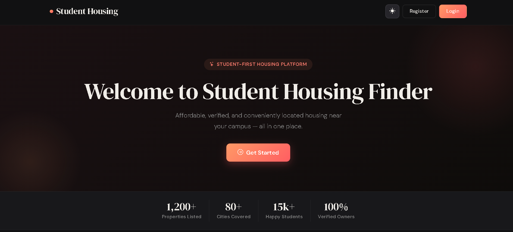
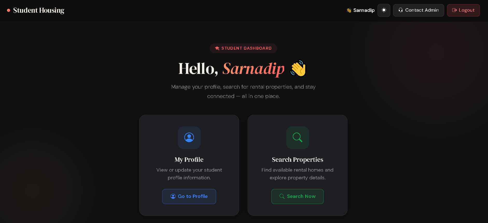
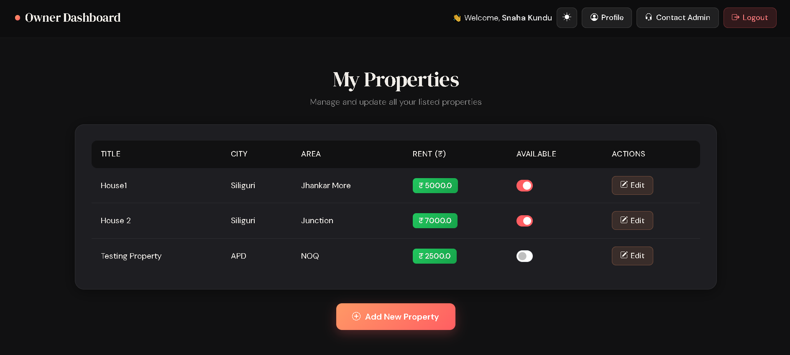
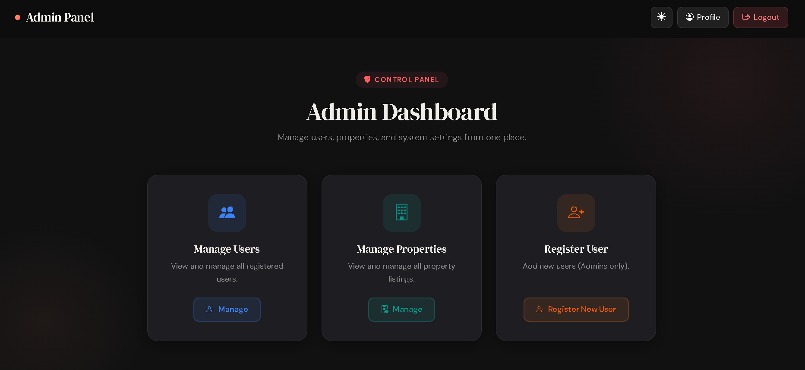
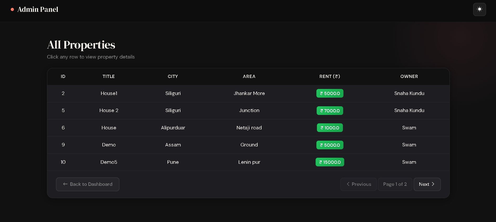
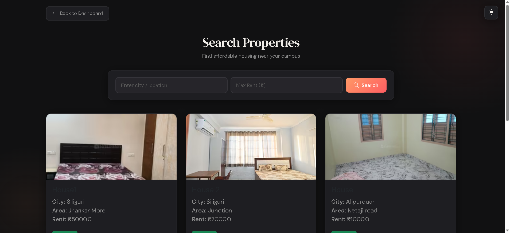

# 🏠 Student Housing Management System

## 📌 Overview
The **Student Housing Management System** is a web-based platform built using **Java Spring Boot, Spring Security, Thymeleaf, and MySQL**.  
It enables **students** to search for rental properties, **owners** to list and manage their properties, and **admins** to manage users and maintain platform integrity.
 
---

## 🚀 Features

### 👨‍🎓 Student Features
- Secure login & registration
- Personal profile (ID, email, phone)
- Search for rental properties by city and max rent
- View full property details with image carousel and owner contact info
- User-friendly dashboard

### 🏠 Owner Features
- Register & manage rental properties
- Upload multiple property images (Cloudinary integration)
- Edit property details — title, city, area, rent, description
- Delete individual images from existing listings
- Toggle property availability directly from the dashboard
- Dashboard with full properties table

### 🔑 Admin Features
- Admin dashboard with cards for Users, Properties, and Register User
- View all registered users in a paginated table
- Edit or delete any user (admins cannot be deleted)
- View all properties in a paginated table
- Access denied page for unauthorized route access

---

## 🛠️ Tech Stack
| Layer | Technology |
|---|---|
| **Backend** | Java 17, Spring Boot, Spring MVC |
| **Frontend** | Thymeleaf, Bootstrap 5, Animate.css |
| **Fonts** | DM Serif Display, DM Sans (Google Fonts) |
| **Database** | MySQL with Spring Data JPA |
| **Security** | Spring Security — role-based access (STUDENT, OWNER, ADMIN) |
| **Image Storage** | Cloudinary (upload + auto-delete on property removal) |
| **UI Theme** | Light / Dark mode toggle with `localStorage` persistence |
 
---

## 🎨 UI Design System

All pages share a consistent design system using CSS variables, supporting seamless light/dark theme switching. Theme preference is saved in `localStorage` under the key `sh-theme`.

### Color Palette
| Variable | Light Mode | Dark Mode |
|---|---|---|
| `--accent` | `#FF5E62` | `#FF5E62` |
| `--accent-2` | `#FF9966` | `#FF9966` |
| `--bg` | `#FAF7F4` | `#111112` |
| `--card-bg` | `#FFFFFF` | `#1E1E22` |
| `--text` | `#1A1A1A` | `#F0EDE8` |
| `--text-muted` | `#777777` | `#888888` |
| `--input-bg` | `#F5F2EF` | `#26252A` |
 
---

## ⚙️ Implementation Details

### 1️⃣ Authentication & Authorization
- Spring Security used for **login, logout, and role-based access control**
- Roles: `ROLE_STUDENT`, `ROLE_OWNER`, `ROLE_ADMIN`
- Custom `LoginSuccessHandler` redirects each role to their respective dashboard on login
- Unauthorized access to protected routes redirects to a friendly `/access-denied` page instead of the default Whitelabel 403 error

### 2️⃣ File Storage
- Images uploaded to **Cloudinary**
- When properties are deleted, images are also removed from Cloudinary

### 3️⃣ Error Handling
- Custom `/access-denied` page for 403 Forbidden errors
- Custom error page for general exceptions (e.g., user not found)

### 4️⃣ Responsive UI
- Bootstrap 5 used for responsiveness
- Navbar buttons collapse into a dropdown on smaller screens
- Dark/light theme toggle on every page, synced across all pages via `localStorage`

---

## 📄 Pages & Routes

| Page | Template | Route | Access |
|---|---|---|---|
| Home | `index.html` | `/` | Public |
| Login | `login.html` | `/login` | Public |
| Register | `register-only-user.html` | `/register-user` | Public |
| Student Dashboard | `student-dashboard.html` | `/student/dashboard` | STUDENT |
| Student Search | `student-search.html` | `/student-search` | STUDENT |
| Owner Dashboard | `owner-dashboard.html` | `/properties/owner/{id}` | OWNER |
| Add Property | `add-property.html` | `/properties/owner/{id}/add` | OWNER |
| Edit Property | `edit-property.html` | `/properties/owner/{id}/edit/{pid}` | OWNER |
| Property Details | `property-details.html` | `/properties/{id}` | Auth |
| User Profile | `user-profile.html` | `/profile/{id}` | Auth |
| Admin Profile | `admin-profile.html` | `/profile/admin` | Auth |
| Admin Dashboard | `admin-dashboard.html` | `/admin/dashboard` | ADMIN |
| Manage Users | `manage-users.html` | `/admin/users` | ADMIN |
| Manage Properties | `manage-properties.html` | `/admin/properties` | ADMIN |
| Edit User | `edit-user.html` | `/admin/users/edit/{id}` | ADMIN |
| Access Denied | `access-denied.html` | `/access-denied` | Public |
 
---

## 📂 Project Structure
```
src/main/java/com/studenthousing
│── controller/     # Controllers for Student, Owner, Admin
│── model/          # Entity classes (User, Property)
│── repository/     # JPA Repositories
│── service/        # Business logic & Cloudinary integration
│── config/         # SecurityConfig, CustomLoginSuccessHandler
│
src/main/resources/templates
│── index.html                  # Home / landing page
│── login.html                  # Login page
│── register-only-user.html     # Registration page
│── student-dashboard.html      # Student dashboard
│── student-search.html         # Property search
│── owner-dashboard.html        # Owner dashboard
│── add-property.html           # Add property form
│── edit-property.html          # Edit property form
│── property-details.html       # Property detail view
│── user-profile.html           # User profile (student/owner)
│── admin-profile.html          # Admin contact profile
│── admin-dashboard.html        # Admin control panel
│── manage-users.html           # Admin user management table
│── manage-properties.html      # Admin properties table
│── edit-user.html              # Admin edit user form
│── access-denied.html          # 403 friendly error page
│── error.html                  # General error page
│── fragments/
│   └── property-list.html      # Reusable property card fragment
```

---

## 🖼️ Screenshots


### Home / Index Page


### Student Dashboard


### Owner Dashboard


### Admin User Management


### Property Details


### Search Properties



---

## ▶️ Running the Project

### 1️⃣ Clone Repository
```bash
git clone https://github.com/yourusername/student-housing-system.git
cd student-housing-system
```

### 2️⃣ Configure MySQL
Update `application.properties`:
```properties
spring.datasource.url=jdbc:mysql://localhost:3306/housing_db
spring.datasource.username=root
spring.datasource.password=yourpassword
```

### 3️⃣ Configure Cloudinary
```properties
cloudinary.cloud_name=your_cloud_name
cloudinary.api_key=your_api_key
cloudinary.api_secret=your_api_secret
```

### 4️⃣ Run the Application
```bash
mvn spring-boot:run
```

Then open [http://localhost:8080](http://localhost:8080).
 
---

## 👥 Roles & Access
| Role | Permissions |
|---|---|
| **Student** | Search properties, view property details, manage own profile |
| **Owner** | Add/edit/delete own properties, manage availability |
| **Admin** | Manage all users and properties, register new users |
 
---

## 📌 Future Enhancements
- Booking system for students
- Payment gateway integration
- Notification system for owners/students
- Advanced analytics dashboard for admins
- Mobile-responsive PWA support

---

## 🏆 Conclusion
The **Student Housing Management System** provides a **centralized, secure, and scalable platform** for students, property owners, and administrators. Built on Spring Boot with a modern Thymeleaf frontend, it features full role-based access control, cloud image storage, a consistent design system with dark/light theming, and is structured for future extensibility.